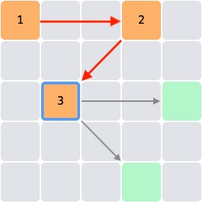

# Magic Square
Magic Square is a puzzle game which you should fill all the cells by following these 2 rules.
* When moving horizontally or vertically skip 2 cells
* When moving diagonally skip 1 cell

Click https://eguller.github.io/magic-square/index.html to play.

Green cells will guide you for your next move.

* If you can fill all the cells, you win.